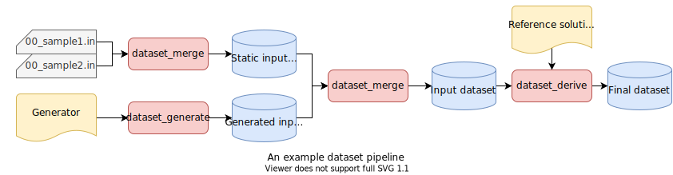

# Building and Testing Datasets

This section describes how to build and test datasets using `rules_contest`.

## What is a dataset?

A *dataset* is a zip archive file containing data files used to evaluate
solution programs. Each data file in a dataset is named as
`<basename>.<extension>` where a basename does not contain a period.

A *test case* consists of data files having the same basename in a dataset.

For example, a dataset consisting of four files, `00_sample1.in`,
`00_sample1.out`, `00_sample2.in` and `10_random.in` contains three test cases
named `00_sample1`, `00_sample2` and `10_random`.

A dataset is often built from other datasets in a pipeline of rules. The
following diagram illustrates an example pipeline that builds a final dataset
from static input data files, a dataset generator program and a reference
solution program.

## Building datasets

Several rules are provided to build datasets.

[`dataset_merge`] rule builds a dataset from zero or more datasets and zero or
more data files. This rule can be used to build a dataset from static data
files, as well as to merge multiple datasets.

[`dataset_generate`] rule builds a dataset by running a program that writes data
files to the directory specified by the `OUTPUT_DIR` environment variable.
This rule is typically used to generate random input data files.

[`dataset_derive`] rule extends a dataset by running a program. A program for
the [`dataset_derive`] rule is run for each test case in the input dataset.
A data file with an input file extension (default: `.in`) is opened and
connected to the standard input of the program, and a data file with an output
file extension (default: `.out`) is opened and connected to the standard output.
 The output dataset is built by combining the data files from the input dataset
 and the generated output files. This rule is typically used to generate answer
 data files by running a reference solution program over input data files.

[`dataset_merge`]: ../api/rules.html#dataset-merge
[`dataset_generate`]: ../api/rules.html#dataset-generate
[`dataset_derive`]: ../api/rules.html#dataset-derive

## Testing datasets

It is important to ensure that built datasets have correct formats and meet
the problem constraints. Currently one rule is provided to test datasets.

[`dataset_test`] rule tests a dataset by running a program. A program for
the [`dataset_test`] rule is run for each test case in the dataset. A data file
with an input file extension (default: `.in`) is opened and connected to the
standard input of the program. A test passes if the program exits normally
(exit code 0) for all test cases.

[`dataset_test`]: ../api/rules.html#dataset-test
