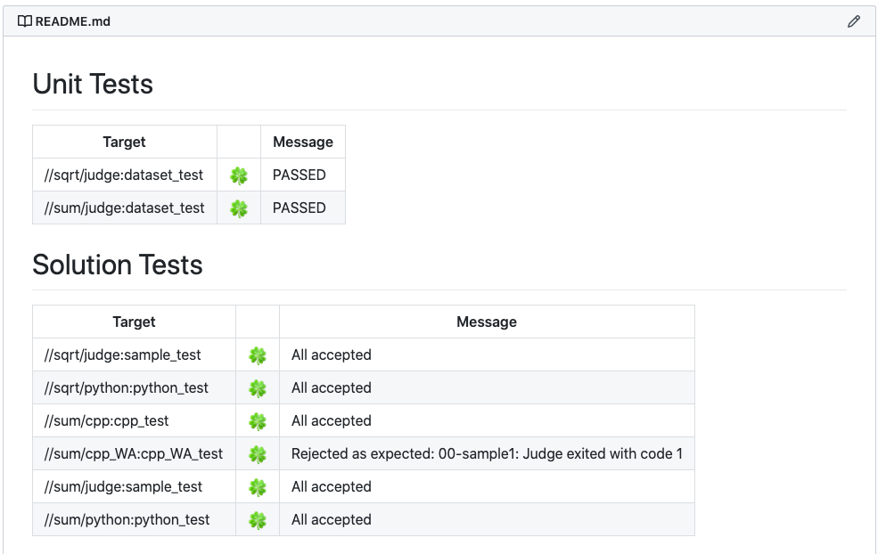

# Building a Progress Tracker

`rules_contest` provides an executable that summarizes test results as a
Markdown document. It can be used to configure CI to build a progress tracker
updated on every commit.

To build a progress tracker, first run tests with `--build_event_json_file` flag
to save test results into a file.

```
bazel test --keep_going --build_event_json_file=build.jsonl //...
```

Then run `@rules_contest//contest:render_test_results` to render it into
a Markdown document.

```
bazel run @rules_contest//contest:render_test_results -- $PWD/build.jsonl > $PWD/report.md
```



See [the GitHub Actions configuration of the template repository] to see how
you can set up CI to build a progress tracker and push the generated document
to a separate branch automatically.

[the GitHub Actions configuration of the template repository]: https://github.com/nya3jp/contest_template/blob/master/.github/workflows/test.yml
