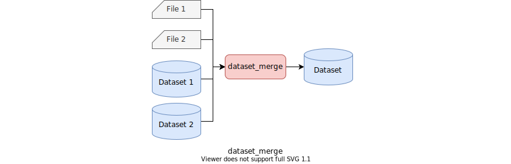

# Rules

All rules are defined in `@rules_contest//contest:defs.bzl`.

To use rules, put the following `load` statement to the top of the `BUILD` file.

```python
load(
    "@rules_contest//contest:defs.bzl",
    "dataset_merge",
    "dataset_generate",
    ...
)
```

## dataset_merge

`dataset_merge(name, files, datasets, **kwargs)`

`dataset_merge` rule builds a dataset from zero or more datasets and zero or
more data files. This rule can be used to build a dataset from static data
files, as well as to merge multiple datasets.

### Parameters

| Parameter | Type | Default | Description |
| --- | --- | --- | --- |
| `name` | `str` | Required | A unique name for the rule. |
| `files` | `List[Label]` | `[]` | A list of static data files to include in the new dataset. |
| `datasets` | `List[Label]` | `[]` | A list of datasets to merge to the new dataset. |



## dataset_generate

`dataset_generate(name, exec, **kwargs)`

`dataset_generate` rule builds a dataset by running a program. By default,
it should write data files to the directory specified by the `OUTPUT_DIR`
environment variable.
This rule is typically used to generate random input data files.

### Parameters

| Parameter | Type | Default | Description |
| --- | --- | --- | --- |
| `name` | `str` | Required | A unique name for the rule. |
| `exec` | `Label` | Required | A label of an executable to run to generate data files. |
| `cmd` | `str` | `${EXEC}` | A shell command to run. |

### Environment variables

The following environment variables are available on running a command.

| Variable | Description |
| --- | --- |
| `EXEC` | A path to the executable specified in the `exec` parameter of the rule. |
| `OUTPUT_DIR` | A path to the directory where generated data files should be saved. |


## dataset_derive

`dataset_derive(name, exec, dataset, input_extension, output_extension, **kwargs)`

`dataset_derive` rule extends a dataset by running a program. A program for
the `dataset_derive` rule is run for each test case in the input dataset.
A data file with an input file extension (default: `.in`) is opened and
connected to the standard input of the program, and a data file with an output
file extension (default: `.out`) is opened and connected to the standard output.
The output dataset is built by combining the data files from the input dataset
and the generated output files. This rule is typically used to generate answer
data files by running a reference solution program over input data files.

### Parameters

| Parameter | Type | Default | Description |
| --- | --- | --- | --- |
| `name` | `str` | Required | A unique name for the rule. |
| `exec` | `Label` | Required | A label of an executable to run to generate data files. |
| `dataset` | `Label` | Required | A label of a dataset that the new dataset derives from. |
| `input_extension` | `str` | `"in"` | The extension of input data files. |
| `output_extension` | `str` | `"ans"` | The extension of output data files. |


## dataset_test

`dataset_test(name, exec, dataset, input_extension, **kwargs)`

`dataset_test` rule tests a dataset by running a program. A program for
the `dataset_test` rule is run for each test case in the dataset. A data file
with an input file extension (default: `.in`) is opened and connected to the
standard input of the program. A test passes if the program exits normally
(exit code 0) for all test cases.

### Parameters

| Parameter | Type | Default | Description |
| --- | --- | --- | --- |
| `name` | `str` | Required | A unique name for the rule. |
| `exec` | `Label` | Required | A label of an executable to run to validate data files. |
| `dataset` | `Label` | Required | A label of a dataset to test. |
| `input_extension` | `str` | `"in"` | The extension of input data files. |


## simple_judge

`simple_judge(name, dataset, comparator, input_extension, answer_extension, **kwargs)`

`simple_judge` rule generates a simple judge program from a dataset containing
inputs and answers, and optionally a *comparator* program. A simple judge runs
a solution for each test case and determines if a program output matches with
an answer by running the specified comparator program. If no comparator is
specified, the default exact comparator is used.

A simple judge optionally accepts a command line flag `--expect` that specifies
the expectation of a solution.

| Flag | Expectation |
| --- | --- |
| `--expect=accept` | A solution is accepted for all test cases (default) |
| `--expect=reject_any` | A solution is rejected for any one of test cases |
| `--expect=reject_all` | A solution is rejected for all test cases |

### Parameters

| Parameter | Type | Default | Description |
| --- | --- | --- | --- |
| `name` | `str` | Required | A unique name for the rule. |
| `dataset` | `Label` | Required | A label of a dataset containing test cases. |
| `comparator` | `Label` | `"@rules_contest//contest:exact_comparator"` | A label of an executable to run to compare an output file and an answer file. |
| `input_extension` | `str` | `"in"` | The extension of input data files. |
| `answer_extension` | `str` | `"ans"` | The extension of answer data files. |


## solution_test

`solution_test(name, solution, judge, judge_args, **kwargs)`

`solution_test` is a test rule that runs a judge against a solution.
On executing a judge program, the path to the specified solution program is
passed as a command line argument. A test is considered pass if the judge
program exits normally (exit code 0). You can also specify extra arguments to
pass to the judge program to control a judge program's behavior.

### Parameters

| Parameter | Type | Default | Description |
| --- | --- | --- | --- |
| `name` | `str` | Required | A unique name for the rule. |
| `solution` | `Label` | Required | A label of a solution executable to pass to the judge. |
| `judge` | `Label` | Required | A label of a judge executable. |
| `judge_args` | `List[str]` | `[]` | A list of extra arguments passed to the judge. |


## jinja2_template

`jinja2_template(name, srcs, main, vars, files, dataset, **kwargs)`

`jinja2_template` rule renders a [Jinja2 template], substituting variables
computed from constraint YAML files, static files and datasets.

### Parameters

| Parameter | Type | Default | Description |
| --- | --- | --- | --- |
| `name` | `str` | Required | A unique name for the rule. |
| `srcs` | `List[Label]` | Required | A list of source template files. |
| `main` | `Label` | `None` | The label of a main template file. Optional if `srcs` contains only a single file. |
| `vars` | `List[Label]` | `[]` | A list of labels of constraint YAML files whose values are made available as template variables. |
| `files` | `List[Label]` | `[]` | A list of labels of static files made available as template variables. |
| `dataset` | `Label` | `None` | An optional bale of a dataset whose contents are made available as template variables. |

### Template variables

Templates have access to the following variables:

| Variable | Description | Example |
| --- | --- | --- |
| `vars` | Constraints from YAML files | `vars.VALUE_MAX` |
| `files` | Content of static files | `files["00_sample1.out"]` |
| `dataset` | Content of the dataset | `dataset["00_sample1.in"]` |

[Jinja2 template]: https://jinja.palletsprojects.com/

## markdown

`markdown(name, src, **kwargs)`

`markdown` rule renders a [Markdown] document to a HTML document. This rule
might be useful to build a file to upload to online judge systems.

### Parameters

| Parameter | Type | Default | Description |
| --- | --- | --- | --- |
| `name` | `str` | Required | A unique name for the rule. |
| `src` | `Label` | Required | The label of a source Markdown file. |

[Markdown]: https://en.wikipedia.org/wiki/Markdown

## cc_yaml_library

`cc_yaml_library(name, src, **kwargs)`

`cc_yaml_library` rule generates a C++ header file from a constraint YAML file.

### Parameters

| Parameter | Type | Default | Description |
| --- | --- | --- | --- |
| `name` | `str` | Required | A unique name for the rule. |
| `src` | `str` | Required | The name of a YAML file. |

## py_yaml_library

`py_yaml_library(name, src, **kwargs)`

`py_yaml_library` rule generates a Python module from a constraint YAML file.

### Parameters

| Parameter | Type | Default | Description |
| --- | --- | --- | --- |
| `name` | `str` | Required | A unique name for the rule. |
| `src` | `str` | Required | The name of a YAML file. |
